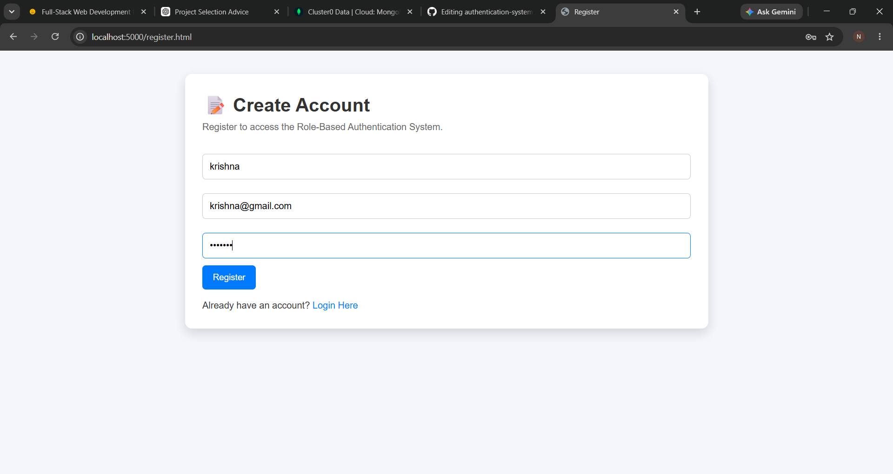
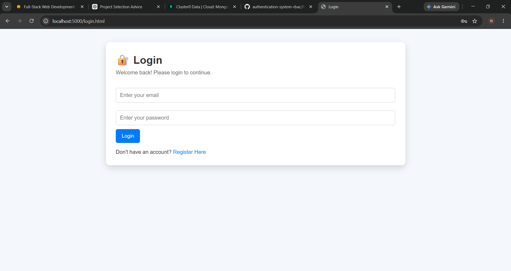
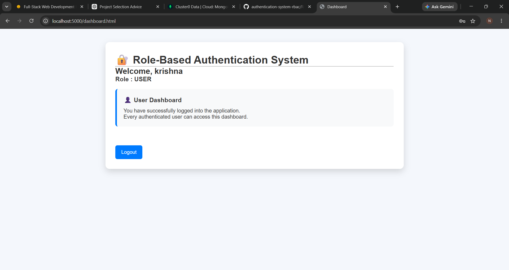
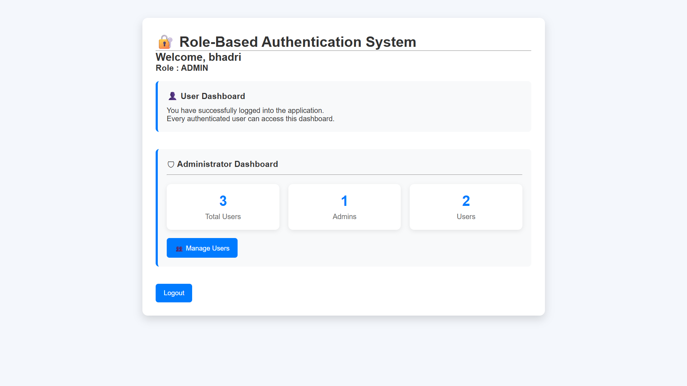
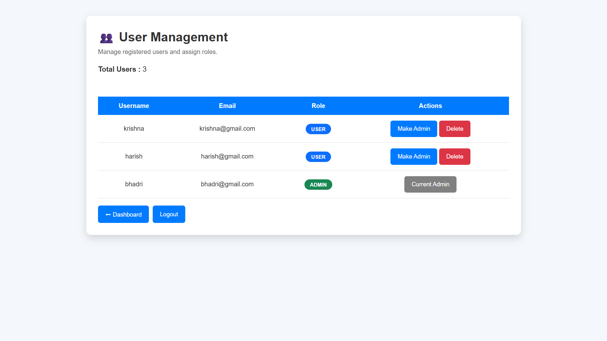
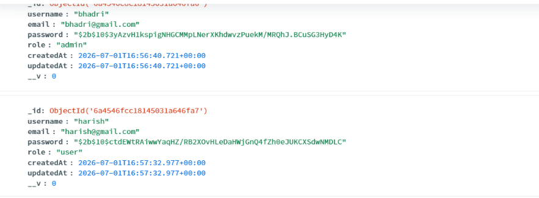

# 🔐 Role-Based Authentication System (RBAC)

A full-stack **Role-Based Authentication System** built using **Node.js, Express.js, MongoDB Atlas, JWT, and bcrypt.js**.

The project demonstrates **Authentication** and **Role-Based Access Control (RBAC)** where different users (Admin and User) have different permissions.

---

## 📌 Features

### Authentication

- User Registration
- User Login
- Password Hashing using bcryptjs
- JWT Authentication
- Protected Routes
- Logout

### Authorization (RBAC)

- User Role
- Admin Role
- Role-Based Route Protection
- Admin Dashboard
- User Dashboard
- User Management

### Admin Features

- View All Users
- Change User Roles
- Delete Users
- Dashboard Statistics
- Prevent Self Role Removal
- Prevent Self Deletion

---

# 🛠 Tech Stack

## Frontend

- HTML5
- CSS3
- JavaScript

## Backend

- Node.js
- Express.js

## Database

- MongoDB Atlas
- Mongoose

## Authentication

- JWT
- bcryptjs

---

# 📂 Project Structure

```
RBAC/
│
├── middleware/
│   └── authMiddleware.js
│
├── models/
│   └── User.js
│
├── public/
│   ├── dashboard.html
│   ├── index.html
│   ├── login.html
│   ├── register.html
│   ├── users.html
│   ├── script.js
│   ├── users.js
│   └── style.css
│
├── routes/
│   └── auth.js
│
├── server.js
├── package.json
├── .env
└── README.md
```

---

# 🔑 User Roles

## 👤 User

- Register
- Login
- View Dashboard
- View Own Profile

---

## 👑 Admin

Everything a User can do plus:

- Access Admin Dashboard
- View All Users
- Change User Roles
- Delete Users
- View Dashboard Statistics

---

# 🔒 Protected API Routes

| Method | Endpoint | Access |
|----------|----------|--------|
| POST | /api/auth/register | Public |
| POST | /api/auth/login | Public |
| GET | /api/auth/profile | User/Admin |
| GET | /api/auth/admin | Admin |
| GET | /api/auth/stats | Admin |
| GET | /api/auth/users | Admin |
| PATCH | /api/auth/users/:id/role | Admin |
| DELETE | /api/auth/users/:id | Admin |

---

# 🔄 Authentication Flow

```
Register
      │
      ▼
Password Hashed
      │
      ▼
Stored in MongoDB
      │
      ▼
Login
      │
      ▼
JWT Generated
      │
      ▼
Token Stored
      │
      ▼
Protected Routes
```

---

# 🛡 RBAC Flow

```
Login
     │
     ▼
JWT Token
     │
     ▼
Contains Role
     │
     ▼
authenticateToken()
     │
     ▼
authorizeRoles()
     │
     ▼

Admin ─────────► Admin Dashboard

User ─────────► User Dashboard
```

---

# ⚙ Installation

## Clone Repository

```bash
git clone https://github.com/yourusername/authentication-system-rbac.git
```

---

## Install Dependencies

```bash
npm install
```

---

## Create .env

```env
PORT=5000

MONGO_URI=YOUR_MONGODB_CONNECTION_STRING

JWT_SECRET=YOUR_SECRET_KEY
```

---

## Run

```bash
npm start
```

or

```bash
node server.js
```

---

Open

```
http://localhost:5000
```

---

# 🗄 Database Schema

## Users Collection

```javascript
{
    username: String,
    email: String,
    password: String,
    role: String,
    createdAt: Date,
    updatedAt: Date
}
```

---

# 📸 Screenshots


## Registration

```
```

---

## Login

```

```

---

## User Dashboard

```

```

---

## Admin Dashboard

```

```

---

## User Management

```

```

---

## MongoDB Atlas

```

```

---


---

# 📋 Internship Deliverables

- ✅ Backend Source Code
- ✅ Frontend Source Code
- ✅ MongoDB Database
- ✅ JWT Authentication
- ✅ Role-Based Authorization
- ✅ Protected Routes
- ✅ Admin Dashboard
- ✅ User Management
- ✅ API Documentation
- ✅ Responsive Interface
- ✅ GitHub Documentation

---

# 🚀 Future Enhancements

- Forgot Password
- Email Verification
- Profile Image Upload
- Search Users
- Filter Users
- Pagination
- Dark Mode
- Activity Logs
- Two-Factor Authentication (2FA)

---

# 👨‍💻 Author

**Nallamothu Bhadri**

Computer Science Engineering Student

Andhra University